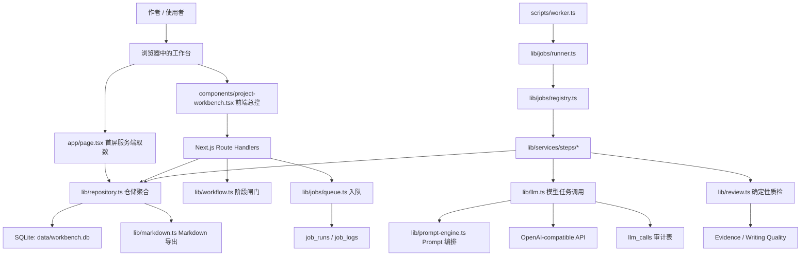
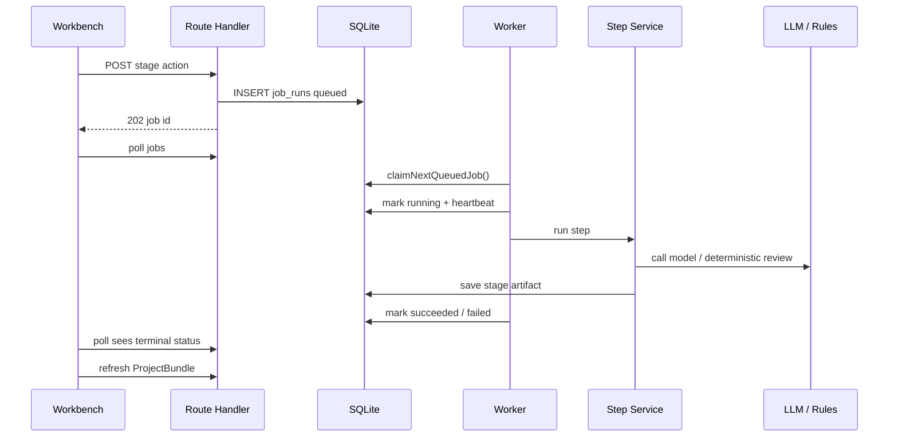

# 上海板块写作工作台完整框架汇报文档

更新时间：2026-04-28

本文档用于对外汇报当前项目的完整框架。它不是单纯的技术栈清单，而是从产品定位、运行模式、页面结构、接口设计、数据库、任务队列、模型调用、写作工作流、证据体系、质量门槛和后续演进边界几个层面说明：这个系统到底是什么、如何运转、为什么这样拆、目前已经做到哪里。

---

## 1. 一句话定位

这个项目是一个本地优先的上海板块写作工作台。

它不是一个普通的内容生成网页，也不是云端多人协作 SaaS。它更接近一个面向单个作者的“写作操作系统”：把一篇上海板块分析文章从选题、资料、判断、建模、提纲、正文、质检到发布前整理，拆成一套可追踪、可回退、可人工干预、可被规则检查的工作流。

核心定位可以概括为：

> 用本地数据库保存完整写作过程，用阶段化工作流组织文章生产，用模型承担生成和整理任务，用确定性规则守住质量底线，最终输出可发布的 Markdown 内容。

---

## 2. 项目边界

### 2.1 它是什么

- 单仓库应用。
- 单用户、本地运行的写作工作台。
- Next.js App Router 应用。
- SQLite 本地持久化系统。
- 阶段驱动的文章生产流程。
- 混合模型与确定性规则的写作辅助系统。
- 可导出 Markdown 的内容生产系统。

### 2.2 它不是什么

- 不是多用户后台。
- 不是带登录、权限、租户的 SaaS。
- 不是云端 CMS。
- 不是一次性“输入题目直接出稿”的简单生成器。
- 不是纯 Prompt 工具。
- 不是只依赖模型判断的黑盒系统。

### 2.3 当前必须保留的设计假设

这些假设来自仓库的架构约束，也是后续汇报时需要讲清楚的原则：

- 本地优先：数据默认存在本机 `data/workbench.db`。
- 单用户：不引入 auth、RBAC、多租户。
- SQLite：不引入 Postgres、Redis、外部队列。
- 阶段驱动：API route 表达“工作流动作”，不是泛 CRUD。
- 规则兜底：模型可以生成，但流程闸门和质检规则必须保留。
- Markdown 导出：最终产物要能脱离系统继续使用。

---

## 3. 技术栈总览

### 3.1 应用层

- Next.js 16 App Router
- React 19
- TypeScript
- 服务端组件首屏取数
- 客户端工作台组件承载交互

### 3.2 数据层

- Node 内置 `node:sqlite`
- SQLite 文件：`data/workbench.db`
- WAL 模式
- 外键约束
- 运行时自动建表与轻量字段补齐

### 3.3 模型层

- OpenAI-compatible Chat Completions API
- `MODEL_MODE=mock` 本地模拟模式
- `MODEL_MODE=remote` 远程模型模式
- 支持任务级超时、token、JSON mode 和审计记录

### 3.4 任务层

- SQLite job system
- 独立 worker：`scripts/worker.ts`
- 队列状态：`queued`、`running`、`succeeded`、`failed`
- 去重、重试、进度、日志、心跳、超时回收

### 3.5 资料与抓取

- 普通网页 HTML 抓取
- 微信公众号保护页检测
- 浏览器模式兜底
- 资料正文清洗
- 模型或规则提炼资料卡摘要

### 3.6 验证与工具

- ESLint
- TypeScript typecheck
- Node test runner
- Playwright 依赖
- 写作质量评估脚本

---

## 4. 运行命令

核心脚本定义在 `package.json`。

| 命令 | 作用 |
| --- | --- |
| `npm run dev` | 只启动 Next.js 开发服务 |
| `npm run dev:all` | 同时启动 Next.js 和后台 worker |
| `npm run build` | 构建生产包 |
| `npm run start` | 启动生产服务 |
| `npm run worker` | 启动后台任务 worker |
| `npm run worker:once` | 只领取并执行一次任务，适合调试 |
| `npm run lint` | 运行 ESLint |
| `npm run typecheck` | TypeScript 类型检查 |
| `npm run import-samples` | 从 `wz/` 导入样本文章 |
| `npm run backfill-project-frames` | 回填项目里的写作卡片兼容字段 |
| `npm run eval:writing-quality` | 跑写作质量评估 |
| `npm run eval:writing-quality:report` | 生成写作质量评估报告 |

开发时最符合当前架构的启动方式是：

```bash
npm run dev:all
```

原因是很多模型生成和资料抓取步骤已经进入后台 job system。只启动 `npm run dev` 可以打开页面，但后台长任务不会被 worker 消费。

---

## 5. 总体架构图



这个图体现了当前系统的核心分工：

- 页面负责展示和触发动作。
- route 负责输入解析、闸门判断、任务入队或轻量保存。
- worker 负责真正执行长任务。
- service step 承担业务编排。
- repository 统一读写 SQLite 和聚合 `ProjectBundle`。
- LLM 层统一处理模型调用、解析、超时、审计。
- review / evidence / writing-quality 层提供确定性质量约束。

---

## 6. 目录职责地图

### 6.1 页面与布局

| 路径 | 职责 |
| --- | --- |
| `app/page.tsx` | 首页服务端入口，读取项目列表、样本列表、默认项目 bundle |
| `app/layout.tsx` | App 根布局 |
| `app/globals.css` | 全局样式 |
| `components/layout/app-shell.tsx` | 工作台外壳 |

### 6.2 主工作台组件

| 路径 | 职责 |
| --- | --- |
| `components/project-workbench.tsx` | 前端总控：项目切换、tab、任务触发、队列反馈、脏数据提示 |
| `components/workbench/ProjectSidebar.tsx` | 项目列表和选题发现入口 |
| `components/workbench/OverviewTab.tsx` | ThinkCard、StyleCore、兼容层和 Vitality 展示编辑 |
| `components/workbench/ResearchTab.tsx` | 研究清单、资料录入、资料库、证据覆盖 |
| `components/workbench/DraftsTab.tsx` | 建模、提纲、正文、发布前整理 |
| `components/workbench/ReviewSidebar.tsx` | 当前项目质检概览 |
| `components/workbench/task-center-modal.tsx` | 全局任务中心 |
| `components/workbench/job-log-panel.tsx` | 单个任务日志展示 |
| `components/workbench/job-status-chip.tsx` | 任务状态视觉标签 |

### 6.3 UI 基础组件

| 路径 | 职责 |
| --- | --- |
| `components/ui/button.tsx` | 按钮 |
| `components/ui/modal.tsx` | 弹窗 |
| `components/ui/toast.tsx` | 提示 |
| `components/ui/surface.tsx` | Panel / Card 等表面组件 |
| `components/ui/accordion-card.tsx` | 折叠卡片 |
| `components/ui/inline-edit.tsx` | 行内编辑 |
| `components/ui/auto-grow-textarea.tsx` | 自动增长输入框 |

### 6.4 API route

API 分为三大类：

- 项目工作流 API：`app/api/projects/**`
- 项目后台任务 API：`app/api/jobs/**`
- 选题发现 API：`app/api/topic-discovery/**`

项目 API 的核心不是“资源 CRUD”，而是“阶段动作”。例如：

- `POST /api/projects/:id/research-brief`
- `POST /api/projects/:id/sector-model`
- `POST /api/projects/:id/outline`
- `POST /api/projects/:id/drafts`
- `POST /api/projects/:id/review`
- `POST /api/projects/:id/publish-prep`

这些接口的含义不是简单保存字段，而是“对当前项目执行一个写作阶段”。

### 6.5 核心领域模块

| 路径 | 职责 |
| --- | --- |
| `lib/types.ts` | 全局领域类型定义 |
| `lib/db.ts` | SQLite 初始化、建表、轻量迁移 |
| `lib/repository.ts` | 数据读写、类型映射、兼容字段、`ProjectBundle` 聚合 |
| `lib/workflow.ts` | 阶段闸门、资料卡校验、发布前门槛 |
| `lib/llm.ts` | 结构化模型调用、mock/remote 模式、超时和解析 |
| `lib/prompt-engine.ts` | 所有模型任务的 Prompt 编排 |
| `lib/review.ts` | 确定性质检和 Vitality 诊断 |
| `lib/markdown.ts` | 项目最终 Markdown 导出 |
| `lib/author-cards.ts` | ThinkCard / StyleCore / VitalityCheck 与兼容层转换 |
| `lib/author-system.ts` | 作者大脑、选题方法、动作要求、禁区 |
| `lib/knowledge-base.ts` | 文章类型规则、语言资产、约束包 |

### 6.6 后台任务模块

| 路径 | 职责 |
| --- | --- |
| `lib/jobs/types.ts` | job step、状态、日志、payload 类型 |
| `lib/jobs/repository.ts` | job 表读写、入队、领取、失败、重试、日志 |
| `lib/jobs/queue.ts` | 项目任务入队封装 |
| `lib/jobs/registry.ts` | job step 到 handler 的映射 |
| `lib/jobs/runner.ts` | 运行已领取任务 |
| `lib/jobs/reaper.ts` | 长时间无心跳任务回收 |
| `lib/jobs/queue-summary.ts` | 队列位置与活跃任务统计 |
| `lib/jobs/handlers/*` | 各 job step 的薄 handler |
| `lib/services/steps/*` | 各写作阶段的真实业务编排 |
| `scripts/worker.ts` | 独立 worker 主循环 |

### 6.7 选题发现模块

| 路径 | 职责 |
| --- | --- |
| `lib/topic-discovery.ts` | 选题发现主流程：预资料卡、Signal Brief、候选角度、创建正式项目 |
| `lib/topic-discovery-jobs.ts` | 选题发现轻量 job 机制 |
| `lib/topic-cocreate.ts` | 选题共创逻辑 |
| `lib/topic-cocreate-postprocess.ts` | 候选角度后处理、去重、评分 |
| `lib/topic-meta.ts` | 选题元信息工具 |
| `lib/signals/*` | 信号查询、抓取、标准化、摘要 |

### 6.8 资料和证据模块

| 路径 | 职责 |
| --- | --- |
| `lib/url-extractor.ts` | URL 正文抓取和解析 |
| `lib/browser-extractor.ts` | 浏览器方式抓取保护页面 |
| `lib/source-summary.ts` | 本地规则资料摘要兜底 |
| `lib/source-card-analysis.ts` | 模型分析资料卡 |
| `lib/evidence/coverage.ts` | 正文引用覆盖分析 |
| `lib/evidence/analyzer.ts` | Evidence Summary 文本生成 |
| `lib/evidence/types.ts` | 证据分析类型 |

### 6.9 写作质量模块

| 路径 | 职责 |
| --- | --- |
| `lib/writing-quality/gate.ts` | 发布前写作质量门槛 |
| `lib/writing-quality/scorecard.ts` | 写作质量评分卡 |
| `lib/writing-quality/summary.ts` | 写作质量摘要 |
| `lib/writing-quality/types.ts` | 质量评估类型 |
| `scripts/evals/run-writing-quality.ts` | 运行质量评估 |
| `scripts/evals/report-writing-quality.ts` | 输出质量报告 |

---

## 7. 首屏加载框架

首页入口是 `app/page.tsx`。它不是空壳客户端页面，而是在服务端先读取必要数据：

1. `listProjects()` 读取项目列表。
2. `listSampleArticles()` 读取样本文章。
3. 如果已有项目，调用 `getProjectBundle(projects[0].id)` 读取默认项目完整上下文。
4. 将这些数据作为 props 传给 `ProjectWorkbench`。

这意味着首屏加载时，工作台已经带着真实数据进入客户端，而不是等浏览器再连续请求所有基础信息。

前端主控组件 `components/project-workbench.tsx` 接收三类初始数据：

- `initialProjects`
- `initialSamples`
- `initialSelectedBundle`

它在客户端继续管理：

- 当前项目 ID
- 当前项目 bundle
- 当前 tab
- 当前聚焦 section
- 后台任务列表
- 任务详情
- 队列状态
- 弹窗和 toast
- 下游产物是否过期

---

## 8. 核心数据模型

### 8.1 项目主对象 `ArticleProject`

`ArticleProject` 是文章项目的主记录，核心字段包括：

- `topic`：选题标题。
- `audience`：目标读者。
- `articleType`：文章类型。
- `stage`：当前阶段。
- `thesis`：主命题。
- `coreQuestion`：核心问题。
- `targetWords`：目标字数。
- `notes`：作者备注。
- `topicMeta`：Signal Brief、Topic Scorecard、选中角度等选题元信息。
- `thinkCard`：选题判断卡。
- `styleCore`：表达策略卡。
- `vitalityCheck`：生命力检查。
- `hkrr`、`hamd`、`writingMoves`：旧系统兼容字段。

### 8.2 项目聚合对象 `ProjectBundle`

工作台大部分页面和导出逻辑都围绕 `ProjectBundle` 工作。它聚合：

- `project`
- `researchBrief`
- `sourceCards`
- `sectorModel`
- `outlineDraft`
- `articleDraft`
- `editorialFeedbackEvents`
- `reviewReport`
- `publishPackage`

这层聚合非常关键。它让 UI、导出、质检和质量分析都能拿同一份完整上下文，而不是在各处分散查询多张表。

### 8.3 写作阶段 `ProjectStage`

当前项目阶段定义为 10 个：

1. 选题定义
2. ThinkCard / HKR
3. StyleCore
4. 研究清单
5. 资料卡整理
6. 板块建模
7. 提纲生成
8. 正文生成
9. VitalityCheck
10. 发布前整理

这个阶段列表不是简单进度条，而是工作台状态机的语言。每一个阶段都对应一类产物、入口、校验和下游依赖。

---

## 9. 数据库框架

### 9.1 初始化方式

数据库初始化在 `lib/db.ts`：

- 确保 `data/` 目录存在。
- 使用 `node:sqlite` 打开 `data/workbench.db`。
- 设置 `PRAGMA journal_mode = WAL`。
- 设置 `PRAGMA foreign_keys = ON`。
- 执行 `CREATE TABLE IF NOT EXISTS`。
- 通过 `ensureColumn()` 做轻量字段补齐。

这套策略适合本地单用户工具：启动时自动保证数据库可用，避免用户手动跑迁移。

### 9.2 主要业务表

| 表 | 作用 |
| --- | --- |
| `sample_articles` | 样本文章库 |
| `sample_action_assets` | 从样本中提取的动作资产 |
| `article_projects` | 项目主表，保存题目、阶段、主卡、兼容字段 |
| `research_briefs` | 研究清单 |
| `source_cards` | 资料卡 |
| `sector_models` | 板块建模结果 |
| `outline_drafts` | 提纲 |
| `article_drafts` | 分析稿、叙事稿、人工编辑稿 |
| `editorial_feedback_events` | 编辑反馈和改写事件 |
| `review_reports` | 质检报告 |
| `publish_packages` | 发布前整理产物 |
| `topic_cocreate_runs` | 选题共创历史记录 |

### 9.3 选题发现表

| 表 | 作用 |
| --- | --- |
| `topic_discovery_sessions` | 一次选题发现会话 |
| `topic_discovery_links` | 会话里的外部链接 |
| `pre_source_cards` | 正式项目创建前的预资料卡 |
| `signal_briefs` | 信号简报 |
| `topic_angle_candidates` | 候选角度池 |
| `topic_discovery_job_runs` | 选题发现任务记录 |
| `topic_discovery_job_logs` | 选题发现任务日志 |

### 9.4 项目后台任务表

| 表 | 作用 |
| --- | --- |
| `job_runs` | 项目级后台任务 |
| `job_logs` | 项目级任务日志 |
| `llm_calls` | 模型调用审计记录 |

`job_runs` 保存任务状态、payload、重试次数、进度、错误和时间戳。`job_logs` 保存过程日志。`llm_calls` 保存模型调用的输入输出 hash、模型名、耗时、token、状态和错误信息。

---

## 10. 仓储层框架

仓储层集中在 `lib/repository.ts`。它不是简单 SQL 工具，而是本项目的本地领域数据层。

主要职责：

- 从 SQLite 行映射到 TypeScript 领域对象。
- 解析 JSON 字段。
- 回填默认值，保证旧数据也能打开。
- 维护新旧写作卡片兼容。
- 聚合 `ProjectBundle`。
- 保存每个阶段产物。
- 读取样本和构造风格参考。
- 管理选题发现会话和候选角度。

为什么要有这层：

- route 不直接散落 SQL。
- UI 不接触数据库原始行。
- JSON 字段解析不会重复写在多个地方。
- ThinkCard / StyleCore 与旧字段的兼容逻辑可以集中维护。
- 新增产物时可以接入同一个 bundle 聚合模型。

---

## 11. 写作卡片与兼容层

当前系统已经从早期的 `HKRR / HAMD / writingMoves` 迁移到新的主表达：

- `ThinkCard`
- `StyleCore`
- `VitalityCheck`

但旧字段没有被删除，而是作为兼容层继续存在。

### 11.1 ThinkCard

ThinkCard 负责回答“这个题值不值得写、为什么值得写、写给谁、读者能拿走什么”。

核心字段包括：

- `materialDigest`
- `topicVerdict`
- `verdictReason`
- `coreJudgement`
- `articlePrototype`
- `targetReaderPersona`
- `creativeAnchor`
- `counterIntuition`
- `readerPayoff`
- `decisionImplication`
- `excludedTakeaways`
- `hkr`
- `rewriteSuggestion`
- `alternativeAngles`
- `aiRole`

### 11.2 StyleCore

StyleCore 负责回答“这篇文章要怎么写才像作者自己，而不是模板化板块稿”。

核心字段包括：

- 节奏推进
- 故意打破
- 开头动作
- 转场动作
- 结尾回环动作
- 知识顺手掏出来
- 私人视角
- 判断力
- 对立面理解
- 允许和禁止的写作动作
- 允许和禁止的比喻
- 情绪曲线
- 亲自下场
- 人物画像
- 文化升维
- 句式断裂
- 回环呼应
- 谦逊铺垫
- 现实代价
- 禁止编造
- 泛化语言黑名单
- unsupported scene 检测

### 11.3 VitalityCheck

VitalityCheck 不是传统语法检查，而是检查文章有没有生命力、是否硬阻塞、是否半阻塞。

它包括：

- `overallStatus`
- `overallVerdict`
- `semiBlocked`
- `hardBlocked`
- `entries`

### 11.4 兼容层策略

兼容层保留：

- `HKRRFrame`
- `HAMDFrame`
- `WritingMovesFrame`

当 ThinkCard 或 StyleCore 更新时，系统通过 `deriveLegacyFrames()` 派生旧字段。这样可以做到：

- 新 UI 以 ThinkCard / StyleCore 为主。
- 旧 prompt、旧规则和旧导出逻辑还能继续读取兼容字段。
- 不破坏旧数据库里的项目。
- 迁移可以渐进完成，而不是一次性切断。

---

## 12. 主写作工作流

### 12.1 完整流程


### 12.2 阶段产物

| 阶段 | 产物 | 保存位置 |
| --- | --- | --- |
| 选题定义 | 项目基本信息 | `article_projects` |
| ThinkCard / HKR | 选题判断卡 | `article_projects.think_card_json` |
| StyleCore | 表达策略卡 | `article_projects.style_core_json` |
| 研究清单 | `ResearchBrief` | `research_briefs` |
| 资料卡整理 | `SourceCard[]` | `source_cards` |
| 板块建模 | `SectorModel` | `sector_models` |
| 提纲生成 | `OutlineDraft` | `outline_drafts` |
| 正文生成 | `ArticleDraft` | `article_drafts` |
| VitalityCheck | `ReviewReport` + `VitalityCheck` | `review_reports` + `article_projects` |
| 发布前整理 | `PublishPackage` | `publish_packages` |
| 导出 | Markdown 文本 | route 即时生成 |

### 12.3 为什么拆成这些阶段

拆阶段的目的不是增加复杂度，而是把写作过程中最容易失控的地方变成可见产物：

- 题值先判断，避免资料很多但题不成立。
- 表达策略先确定，避免正文变成通用板块稿。
- 资料卡先沉淀，避免正文无来源。
- 板块建模先做，避免文章没有空间结构。
- 提纲先写，避免正文直接散。
- 正文后质检，避免模型稿直接发布。
- 发布前整理单独做，避免标题、摘要、配图位和最终稿混在一起。

---

## 13. 工作流闸门

闸门逻辑集中在 `lib/workflow.ts`。

### 13.1 研究清单闸门

`canGenerateResearch(project, forceProceed)`：

- 检查 ThinkCard 是否过线。
- 如果是 `pass`，允许生成。
- 如果是 `warn` 且用户明确 force proceed，也允许生成。
- 如果是 `fail`，阻止继续。

### 13.2 提纲闸门

`canGenerateOutline(project, forceProceed)`：

- 先检查 ThinkCard。
- 再检查 StyleCore 是否满足提纲需要。
- warn 状态下可以人工确认继续。

### 13.3 正文闸门

`canGenerateDraft(project, forceProceed)`：

- 复用提纲闸门。
- 再检查 StyleCore 是否满足正文生成需要。
- route 还额外要求必须有资料卡、板块建模和提纲。

### 13.4 发布前闸门

`canPreparePublish(reviewReport, vitalityCheck)`：

- 必须已有 review report。
- 必须已有 VitalityCheck。
- `hardBlocked` 时禁止发布前整理。
- Quality Pyramid 的 L1 层失败时禁止继续。

### 13.5 人工强行继续机制

一些 warn 状态不会直接硬挡，而是返回：

- HTTP 409
- `needsConfirmation: true`
- gate 详情

前端看到后弹出确认框。用户确认后，带 `forceProceed: true` 再提交一次。

这个机制让系统保持“默认保守，但允许作者承担风险继续”。

---

## 14. 后台任务系统

### 14.1 为什么需要 job system

早期同步请求适合短任务，但不适合：

- 远程模型长时间思考。
- 正文生成。
- 资料链接抓取。
- 发布前整理。
- 重试和错误追踪。
- 前端明确展示任务状态。

因此当前项目已经把主要长任务接入 SQLite job system。

### 14.2 当前项目级 job step

定义在 `lib/jobs/types.ts`：

- `research-brief`
- `sector-model`
- `outline`
- `drafts`
- `review`
- `publish-prep`
- `source-card-extract`
- `source-card-summarize`

### 14.3 入队流程

以生成研究清单为例：

1. 前端调用 `POST /api/projects/:id/research-brief`。
2. route 读取项目。
3. route 调用 `canGenerateResearch()` 做闸门判断。
4. route 调用 `enqueueProjectJob()`。
5. `enqueueJob()` 写入 `job_runs`。
6. API 返回 202 和 job id。
7. 前端轮询 `/api/projects/:id/jobs`。
8. worker 领取任务并执行。
9. 任务完成后前端刷新 bundle。

### 14.4 Worker 执行流程



### 14.5 去重机制

`job_runs` 有活跃任务唯一索引：

```sql
CREATE UNIQUE INDEX IF NOT EXISTS uniq_job_runs_active_dedupe
ON job_runs(dedupe_key)
WHERE status IN ('queued', 'running');
```

这意味着同一项目同一步骤已经排队或运行时，重复点击不会创建多个同类任务，而是返回已有任务。

资料抓取和资料摘要还支持 `dedupeScope`：

- URL 抓取按 URL 去重。
- 文本摘要按标题 + 原文去重。

### 14.6 重试机制

失败任务可以通过任务中心重试：

- `POST /api/jobs/:jobId/retry`
- 新任务保存 `parentJobId`
- 复用原 payload
- 使用新的 dedupe key

### 14.7 删除机制

任务中心允许删除仍在 `queued` 状态的任务：

- `DELETE /api/jobs/:jobId`
- 运行中任务不能删除。
- 已完成任务作为历史记录保留。

### 14.8 心跳和超时回收

worker 会周期性写 heartbeat。`reapStaleJobs()` 会把长时间无心跳的 running job 标记为失败，避免任务永远卡在运行中。

相关环境变量：

- `JOB_WORKER_POLL_INTERVAL_MS`
- `JOB_WORKER_STALE_AFTER_MS`
- `JOB_WORKER_CONCURRENCY`

---

## 15. 任务中心与前端轮询

前端任务状态主要由两个 hook 管理：

- `hooks/use-job-polling.ts`
- `hooks/use-job-action.ts`

### 15.1 `useJobPolling`

负责每 2 秒读取当前项目任务列表：

- `/api/projects/:id/jobs`
- 队列摘要
- 当前项目最近任务
- 任务排队位置
- 任务错误信息

### 15.2 `useJobAction`

负责提交一个 job，并可跟踪单个 job 详情：

- 统一处理 POST。
- 处理 409 确认机制。
- 拿到 job id。
- 轮询 `/api/jobs/:jobId`。
- 在 succeeded / failed 时触发回调。

### 15.3 任务中心

`TaskCenterModal` 调用：

- `GET /api/jobs?limit=60`
- `DELETE /api/jobs/:jobId`
- `POST /api/jobs/:jobId/retry`

它给用户的能力是：

- 看全局任务队列。
- 看运行中、排队中、活跃任务数。
- 删除排队任务。
- 重试失败任务。
- 看恢复建议。

---

## 16. 模型任务框架

### 16.1 任务化模型调用

模型层不把所有事情写成一个大 prompt，而是定义了多个任务类型：

- `topic_cocreate`
- `think_card`
- `topic_judge`
- `source_card_summarizer`
- `research_brief`
- `sector_modeler`
- `outline_writer`
- `draft_writer`
- `draft_polisher`
- `opening_rewriter`
- `transition_rewriter`
- `evidence_weaver`
- `scene_inserter`
- `cost_sharpener`
- `ending_echo_rewriter`
- `anti_cliche_rewriter`
- `vitality_reviewer`
- `quality_reviewer`
- `publish_prep`
- `publish_summary_refiner`

这样拆的好处：

- 每一步上下文更清楚。
- 每一步产物结构更稳定。
- 超时和 token 可以按任务调。
- 出错时能定位具体任务。
- 某些任务可以走 JSON，正文类任务可以走 Markdown。

### 16.2 Prompt 层

`lib/prompt-engine.ts` 负责构造每个任务的 system / user prompt。

Prompt 上下文包括：

- 项目基本信息。
- ThinkCard。
- StyleCore。
- 样本风格参考。
- 作者大脑。
- 文章类型专项规则。
- 语言资产。
- 资料卡。
- Signal Brief。
- 研究清单。
- 板块模型。
- 提纲。
- 正文。
- 确定性质检结果。

### 16.3 LLM 调用层

`lib/llm.ts` 负责：

- mock / remote 切换。
- 构造 OpenAI-compatible 请求。
- 设置 JSON mode。
- 设置 `thinking` / `reasoning_effort`。
- 设置任务级 timeout。
- 设置任务级 max tokens。
- 处理 timeout。
- 处理 API 错误。
- 解析 JSON。
- 对截断输出做 retry。
- 对 Markdown 任务做普通文本处理。
- 记录 `llm_calls` 审计。

### 16.4 关键环境变量

| 环境变量 | 作用 |
| --- | --- |
| `MODEL_MODE` | `mock` 或 `remote` |
| `MODEL_NAME` | 模型名 |
| `MODEL_API_BASE_URL` | API base URL |
| `MODEL_API_PATH` | API path，默认 `/chat/completions` |
| `MODEL_API_KEY` | 模型 API Key |
| `MODEL_TEMPERATURE` | 温度 |
| `MODEL_THINKING_TYPE` | thinking 参数 |
| `MODEL_REASONING_EFFORT` | reasoning effort |
| `MODEL_TIMEOUT_SCALE` | 超时倍率 |
| `MODEL_MAX_TOKEN_SCALE` | token 倍率 |

---

## 17. 选题发现框架

选题发现是正式写作项目之前的一层“题池生成”能力。它帮助作者从板块、直觉、材料和链接中生成候选选题，再把选中的候选题转成正式项目。

### 17.1 选题发现流程


### 17.2 选题发现核心对象

- `TopicDiscoverySession`：一次选题发现会话。
- `TopicDiscoveryLink`：会话里的资料链接。
- `PreSourceCard`：正式项目创建前的预资料卡。
- `PersistedSignalBrief`：信号简报。
- `TopicAngle`：候选角度。
- `TopicDiscoveryBundle`：会话聚合对象。

### 17.3 Signal Brief

Signal Brief 由 `lib/signals/provider.ts` 生成，支持三种模式：

- `input_only`：只使用用户输入材料。
- `url_enriched`：从输入中的 URL 抓取补充信号。
- `search_enabled`：基于查询做搜索，再抓取部分 URL。

Signal Brief 包含：

- `queries`
- `signals`
- `gaps`
- `freshnessNote`

### 17.4 候选角度生成

候选角度来自 `topic_cocreate` 模型任务，再经过 `postprocessTopicCoCreateResult()` 做后处理。

角度类型包括：

- 总判断型
- 反常识型
- 空间切割型
- 客群视角型
- 交易微观型
- 供给结构型
- 政策传导型
- 时间窗口型
- 对比参照型
- 风险拆解型
- 决策服务型
- 叙事升级型
- 人物/场景型
- 生命周期型
- 错配型
- 文化/心理型

### 17.5 从候选题创建正式项目

`createProjectFromTopicDiscovery()` 做几件事：

1. 读取选题发现 bundle。
2. 找到用户选择的候选角度。
3. 用候选角度生成项目 topic、thesis、coreQuestion。
4. 构造 ThinkCard / StyleCore。
5. 派生旧兼容字段。
6. 创建 `ArticleProject`。
7. 把选中的 `PreSourceCard` 导入为正式 `SourceCard`。
8. 把 Signal Brief、Topic Scorecard、选中角度写入 `topicMeta`。

---

## 18. 资料卡与证据框架

### 18.1 资料卡 `SourceCard`

资料卡不是简单链接收藏，而是一条可用于写作论证的结构化材料。

核心字段包括：

- `title`
- `url`
- `note`
- `publishedAt`
- `summary`
- `evidence`
- `credibility`
- `sourceType`
- `supportLevel`
- `claimType`
- `timeSensitivity`
- `intendedSection`
- `reliabilityNote`
- `tags`
- `zone`
- `rawText`

### 18.2 资料录入路径

当前资料进入项目有三条路径：

1. 手动创建资料卡。
2. 输入 URL，后台抓取并填充资料卡表单。
3. 粘贴原文，后台摘要生成资料卡字段。

正式保存资料卡时会调用 `validateSourceCardInput()`，确保：

- 标题不能为空。
- 摘要不能为空。
- 证据片段不能为空。
- 可信度不能为空。
- 至少有一个标签。

### 18.3 URL 抓取

`lib/url-extractor.ts` 支持：

- 普通网页 fetch。
- title / publish time / article body 提取。
- 微信公众号页面识别。
- 微信保护页错误提示。
- 浏览器模式兜底。
- 正文清洗。
- 调用资料分析生成 summary / evidence / tags。

### 18.4 证据覆盖分析

`lib/evidence/coverage.ts` 会分析正文里的 `[SC:xxx]` 引用。

它计算：

- 正文引用了哪些资料卡。
- 哪些引用是有效的。
- 哪些引用已经失效。
- 每个提纲 section 预期证据是否在正文中出现。
- 哪些资料卡是孤立的。
- 哪些关键判断缺证据。

输出指标包括：

- `citationCoverage`
- `brokenCitationCount`
- `sectionEvidenceCoverage`
- `keyPointCoverage`
- `orphanSourceCardCount`

这些指标会进入：

- ResearchTab 的资料库展示。
- Markdown 导出里的 Evidence Summary。
- 写作质量门槛。

---

## 19. 板块建模与提纲框架

### 19.1 板块建模 `SectorModel`

板块建模不是普通摘要，而是把资料和选题判断转成空间结构。

核心字段：

- `summaryJudgement`
- `misconception`
- `spatialBackbone`
- `cutLines`
- `zones`
- `supplyObservation`
- `futureWatchpoints`
- `evidenceIds`

其中 `zones` 表达板块内部的分区结构：

- 片区 ID
- 名称
- 标签
- 描述
- 证据 ID
- 优势
- 风险
- 适合买家

### 19.2 提纲 `OutlineDraft`

提纲不只是标题列表，而是每个段落的写作动作说明。

每个 `OutlineSection` 包含：

- heading
- purpose
- sectionThesis
- singlePurpose
- mustLandDetail
- sceneOrCost
- mainlineSentence
- callbackTarget
- microStoryNeed
- discoveryTurn
- opposingView
- readerUsefulness
- evidenceIds
- mustUseEvidenceIds
- tone
- move
- break
- bridge
- transitionTarget
- counterPoint
- styleObjective
- keyPoints
- expectedTakeaway

这说明提纲承担三类职责：

- 内容结构：这一段讲什么。
- 证据结构：这一段必须引用什么资料。
- 表达动作：这一段用什么语气、节奏、转折和回环。

---

## 20. 正文生成与改写框架

### 20.1 ArticleDraft

正文产物包含三层：

- `analysisMarkdown`：分析版草稿。
- `narrativeMarkdown`：叙事版草稿。
- `editedMarkdown`：人工编辑稿。

导出和发布前整理时优先使用：

1. `publishPackage.finalMarkdown`
2. `articleDraft.editedMarkdown`
3. `articleDraft.narrativeMarkdown`
4. `articleDraft.analysisMarkdown`

### 20.2 为什么保留三层

三层结构的意义是把“模型生成”和“作者编辑”分开：

- 分析稿保存结构和论证。
- 叙事稿保存更接近发布的表达。
- 人工编辑稿保存作者最终修订。

这样后续可以比较：

- 模型稿与人工稿差异。
- 哪些段落被大改。
- 哪些写作动作不够有效。

### 20.3 改写任务

Prompt 层已经定义多个局部改写任务：

- 开头重写
- 转场重写
- 证据织入
- 场景插入
- 现实代价强化
- 结尾回环重写
- 去套话重写

这些任务使系统可以从“整篇重写”逐步走向“定位问题点后局部修复”。

---

## 21. 质检框架

质检不是单一模型评分，而是确定性规则和模型诊断的组合。

### 21.1 确定性质检

`lib/review.ts` 中的 `runDeterministicReview()` 会检查：

- HAMD 开题卡是否完整。
- 语言资产是否出现。
- HKRR 传播约束是否完整。
- 写作动作卡是否完整。
- 文章类型专项检查。
- 主命题是否存在。
- 片区拆解是否完整。
- 空间结构是否存在。
- 关键判断是否挂来源。
- AI 套话。
- 软文风险。
- 反常识开头。
- Anchor 是否落地。
- Hook 是否落地。
- Different 是否落地。
- 私人视角。
- 人物 / 生活场景。
- Unsupported Scene。
- 文化升维。
- 现实代价。
- 新的具体观察。
- 回环呼应。
- 段落可读性。
- 上下文衔接。

### 21.2 ReviewReport

质检结果保存为 `ReviewReport`，包括：

- `overallVerdict`
- `completionScore`
- `globalScore`
- `checks`
- `qualityPyramid`
- `sectionScores`
- `paragraphFlags`
- `rewriteIntents`
- `revisionSuggestions`
- `preservedPatterns`
- `missingPatterns`

### 21.3 Quality Pyramid

Quality Pyramid 是分层质量模型：

- L1：基础硬门槛。
- L2：结构和证据。
- L3：表达和叙事。
- L4：风格、传播和完成度。

其中 L1 失败会阻止发布前整理。

### 21.4 Writing Quality Gate

`lib/writing-quality/gate.ts` 会结合：

- 证据覆盖分析。
- ReviewReport。
- Quality Pyramid。
- rewrite intents。
- paragraph flags。

生成：

- `mode`
- `overallStatus`
- `mustFix`
- `shouldFix`
- `optionalPolish`

这个结果会写入 `PublishPackage.qualityGate`，作为发布前整理时的质量提示。

---

## 22. 发布前整理与导出

### 22.1 PublishPackage

发布前整理产物包括：

- `titleOptions`
- `summary`
- `finalMarkdown`
- `imageCues`
- `publishChecklist`
- `qualityGate`

### 22.2 发布前整理流程

`preparePublishStep()` 做以下事情：

1. 读取项目。
2. 读取 review report。
3. 调用 `canPreparePublish()`。
4. 读取正文、板块模型、提纲、研究清单、资料卡。
5. 计算 writing quality gate。
6. 调用 `publish_prep` 模型任务。
7. 如果摘要质量不够，再调用 `publish_summary_refiner`。
8. 把 quality gate 附到 publish package。
9. 保存发布前整理结果。
10. 更新项目阶段为“发布前整理”。

### 22.3 Markdown 导出

`lib/markdown.ts` 的 `buildProjectMarkdown()` 会把整个 `ProjectBundle` 拼成一份完整 Markdown。

导出内容包括：

- 标题和项目基础信息。
- Signal Summary。
- Topic Scorecard。
- ThinkCard。
- StyleCore。
- 核心问题。
- 研究清单。
- 板块建模。
- 提纲。
- 成文稿。
- 资料卡索引。
- Evidence Summary。
- Writing Quality Summary。
- 质检报告。
- Quality Pyramid。
- Editorial Feedback。
- VitalityCheck。
- 发布前整理。

这保证最终 Markdown 不只是正文，也是一份可复盘的写作档案。

---

## 23. 样本与作者风格框架

### 23.1 样本导入

`npm run import-samples` 从 `wz/` 导入样本文章到 `sample_articles`。

样本字段包括：

- 标题
- 板块名
- 文章类型
- 核心论点
- 结构摘要
- 高光句
- 比喻
- 开头模式
- 原文路径
- 正文

### 23.2 样本动作资产

`sample_action_assets` 保存从样本中抽取的动作资产，例如：

- 判断方式
- 结构推进
- 转场方式
- 高信号表达
- 命名模式

### 23.3 风格参考

`buildStyleReference()` 会基于当前 topic / articleType 选取相关样本，形成模型任务的风格参考。

Prompt 中明确限制：

- 样本只能学习判断路径、问题意识、结构推进和落点方式。
- 禁止复用历史样本里的标题词、比喻、高光句和记忆点。
- 新文章的抓手必须从本次材料中长出来。

这正是该系统和普通“仿写 prompt”的关键区别：它学的是动作，不是抄表达。

---

## 24. 接口分组说明

### 24.1 项目接口

| 接口 | 作用 |
| --- | --- |
| `GET /api/projects` | 获取项目列表 |
| `POST /api/projects` | 创建项目 |
| `GET /api/projects/:id` | 获取项目 bundle |
| `PATCH /api/projects/:id` | 保存 ThinkCard / StyleCore / 兼容字段 / 手工产物 |

### 24.2 阶段任务接口

| 接口 | 作用 |
| --- | --- |
| `POST /api/projects/:id/research-brief` | 入队生成研究清单 |
| `POST /api/projects/:id/sector-model` | 入队生成板块建模 |
| `POST /api/projects/:id/outline` | 入队生成提纲 |
| `POST /api/projects/:id/drafts` | 入队生成正文 |
| `PATCH /api/projects/:id/drafts` | 保存人工编辑稿 |
| `POST /api/projects/:id/review` | 入队运行质检 |
| `GET /api/projects/:id/publish-prep` | 读取发布前整理 |
| `POST /api/projects/:id/publish-prep` | 入队生成发布前整理 |

### 24.3 资料卡接口

| 接口 | 作用 |
| --- | --- |
| `POST /api/projects/:id/source-cards` | 保存资料卡 |
| `DELETE /api/projects/:id/source-cards/:sourceCardId` | 删除资料卡 |
| `POST /api/projects/:id/source-cards/extract` | 入队 URL 抓取 |
| `POST /api/projects/:id/source-cards/summarize` | 入队原文摘要 |

### 24.4 任务接口

| 接口 | 作用 |
| --- | --- |
| `GET /api/projects/:id/jobs` | 获取当前项目任务列表 |
| `GET /api/jobs` | 获取全局最近任务 |
| `GET /api/jobs/:jobId` | 获取任务详情和日志 |
| `DELETE /api/jobs/:jobId` | 删除排队任务 |
| `POST /api/jobs/:jobId/retry` | 重试失败任务 |

### 24.5 选题发现接口

| 接口 | 作用 |
| --- | --- |
| `POST /api/topic-discovery/sessions` | 创建选题发现会话 |
| `GET /api/topic-discovery/sessions/latest` | 获取最近会话 |
| `GET /api/topic-discovery/sessions/:id` | 获取会话 bundle |
| `PATCH /api/topic-discovery/sessions/:id` | 更新会话 |
| `GET /api/topic-discovery/sessions/:id/links` | 获取会话链接 |
| `POST /api/topic-discovery/sessions/:id/links` | 保存会话链接 |
| `GET /api/topic-discovery/sessions/:id/pre-source-cards` | 获取预资料卡 |
| `POST /api/topic-discovery/sessions/:id/pre-source-cards/extract` | 同步抽取预资料卡 |
| `GET /api/topic-discovery/sessions/:id/signal-brief` | 获取 Signal Brief |
| `POST /api/topic-discovery/sessions/:id/signals` | 同步生成 Signal Brief |
| `GET /api/topic-discovery/sessions/:id/topic-angles` | 获取候选角度 |
| `POST /api/topic-discovery/sessions/:id/topic-cocreate` | 同步生成候选角度 |
| `POST /api/topic-discovery/sessions/:id/create-project` | 从候选角度创建正式项目 |
| `GET /api/topic-discovery/jobs/:jobId` | 获取选题发现任务详情 |
| `GET /api/topic-discovery/sessions/:id/jobs` | 获取会话任务 |
| `POST /api/topic-discovery/sessions/:id/jobs` | 入队并立即运行选题发现任务 |

---

## 25. 状态一致性与脏数据提示

当前前端会记录某些下游产物是否因为上游修改而过期。

例如：

- 修改 ThinkCard / StyleCore 后，研究清单、板块建模、提纲、正文、质检、发布整理都可能过期。
- 保存资料卡后，板块建模、提纲、正文、质检、发布整理可能过期。
- 完成某一步任务后，相关脏标记会被清理，部分下游产物会重新标记为过期。

这些状态保存在浏览器 localStorage：

- `workbench-stale-artifacts`

这是一种轻量的本地提示机制，不改变数据库里的历史产物，但提醒作者哪些内容可能需要重生成。

---

## 26. 错误处理与恢复能力

当前系统的恢复能力主要体现在：

- route 返回中文错误。
- workflow gate 返回可解释的阻断原因。
- job 失败会保存 `errorCode` 和 `errorMessage`。
- job logs 保存过程信息。
- 任务中心对失败任务提供重试。
- URL 抓取失败会提示复制原文。
- 模型超时会给出任务级提示。
- JSON 解析失败会区分截断和格式错误。
- 长时间无心跳任务会被回收为失败。
- 重复点击会被 dedupe 成同一个活跃任务。

这让系统从“失败了只能刷新页面”提升为“失败可定位、可重试、可人工绕过”。

---

## 27. 测试与验证框架

当前测试目录覆盖了多个关键子系统：

- `tests/phase2-job-system.test.mjs`
- `tests/job-claiming.test.mjs`
- `tests/job-queue-summary.test.mjs`
- `tests/task-center-route.test.mjs`
- `tests/source-card-routes.test.mjs`
- `tests/topic-discovery-route.test.mjs`
- `tests/topic-cocreate-route.test.mjs`
- `tests/signals-provider.test.mjs`
- `tests/evidence-analyzer.test.mjs`
- `tests/writing-quality-gate.test.mjs`
- `tests/writing-quality-scorecard.test.mjs`
- `tests/review-diagnostics.test.mjs`
- `tests/rewrite-pipeline.test.mjs`
- `tests/thinkcard-stylecore.test.mjs`
- `tests/home-shell.test.mjs`

常规验证建议：

```bash
npm run typecheck
npm run lint
npm run build
node --experimental-strip-types --import ./scripts/register-alias.mjs --test tests/phase2-job-system.test.mjs tests/source-card-routes.test.mjs tests/topic-discovery-route.test.mjs
```

如果修改了具体模块，应优先运行对应测试，再跑更宽的检查。

---

## 28. 现有架构的优点

### 28.1 本地优先，部署成本低

不依赖云数据库、登录系统、对象存储和外部队列。适合个人写作工作台快速迭代。

### 28.2 阶段化强

每一步都有明确产物，不是黑盒生成。作者可以在每个阶段暂停、修正、重跑。

### 28.3 模型与规则分工清楚

模型负责生成、总结、改写。规则负责硬约束、证据覆盖、质量门槛和发布阻断。

### 28.4 可追踪

SQLite 保存项目产物、任务状态、任务日志和模型调用审计。出现问题时可以查到是哪一步失败。

### 28.5 可恢复

失败任务可重试，排队任务可删除，重复任务可去重，长时间卡住的任务可回收。

### 28.6 风格系统有长期价值

系统不是简单收集样本句式，而是把作者的判断方式、写作动作、语言资产和禁区沉淀成可复用约束。

---

## 29. 当前架构的限制

### 29.1 迁移体系仍偏轻量

`ensureColumn()` 适合本地演进，但还不是严格版本化迁移系统。如果未来数据结构持续复杂，可能需要引入明确 migration 记录。

### 29.2 选题发现任务和项目任务仍是两套机制

项目级长任务已经有统一 worker；选题发现当前使用自己的轻量 job 表，并在 route 内 `runTopicDiscoveryJobNow()` 立即执行。它不是外部队列，但和项目 job system 仍是两套实现。

如果未来选题发现任务继续变重，可以考虑并入同一套 worker，但要避免创建第三套异步路径。

### 29.3 当前仍是单用户本地系统

这是设计选择，不是缺陷。但如果对外多人使用，需要重新考虑：

- 用户隔离。
- 并发写入。
- 权限。
- 数据备份。
- API 鉴权。

这些当前都不应该贸然加入。

### 29.4 模型输出仍有不稳定性

虽然有 JSON mode、解析、重试、审计和规则兜底，但模型任务仍可能出现：

- 超时。
- 输出截断。
- JSON 不合法。
- 摘要不准。
- 正文风格漂移。

因此当前架构保留了人工编辑、规则质检和发布前质量门槛。

### 29.5 证据引用依赖 `[SC:id]`

证据覆盖分析依赖正文中出现 `[SC:xxx]`。如果模型或人工编辑删除引用，覆盖率会下降。这是可解释的，但也要求用户理解资料卡引用规范。

---

## 30. 汇报时建议讲法

### 30.1 对非技术听众

可以这样讲：

> 这个系统不是让 AI 一次性写文章，而是把一个作者真实写文章的过程拆开：先判断题值，再定表达策略，再收资料，再建板块模型，再搭提纲，再写正文，再做质检，最后整理成可发布稿。每一步都能保存、修改、重跑，资料和引用也能被追踪。

重点强调：

- 它是写作工作流，不是简单生成器。
- 它保留作者判断。
- 它把资料、判断、表达和质检拆开。
- 它最终输出可发布内容。

### 30.2 对技术听众

可以这样讲：

> 这是一个本地优先的 Next.js + SQLite 工作流应用。UI 通过 App Router route handler 触发阶段动作，route 做闸门校验并把长任务写入 SQLite job_runs。独立 worker 领取任务，通过 step service 调用 LLM、确定性规则和 repository，最终把产物保存回 SQLite。前端轮询任务状态并刷新 ProjectBundle。核心读模型是 ProjectBundle，核心状态语言是 ProjectStage，核心质量保障是 workflow gate + deterministic review + evidence coverage + writing quality gate。

重点强调：

- API 是 stage action，不是普通 CRUD。
- `ProjectBundle` 是 canonical read model。
- SQLite 同时保存业务数据和任务队列。
- worker 与 route 解耦长任务。
- LLM 调用被任务化、审计化。
- 规则层提供硬约束。

### 30.3 对产品/内容团队

可以这样讲：

> 它把一个成熟作者的写作过程产品化：选题强不强、读者为什么要看、资料是否够、板块结构是否成立、正文有没有生命力、有没有证据支撑、能不能发布，都变成了可见检查项。AI 不是代替作者，而是承担资料整理、结构生成、草稿生成和局部改写；作者保留判断和最终编辑权。

重点强调：

- 写作动作被产品化。
- 质量门槛可见。
- 资料来源可追踪。
- 可形成长期风格资产。

---

## 31. 后续演进建议

### 31.1 近期优先级

1. 继续把选题发现 job 与项目 job 的边界梳理清楚。
2. 增强任务详情页里的失败原因和可操作恢复建议。
3. 继续提升资料卡标题/摘要/证据的人类可读性。
4. 强化正文中 `[SC:id]` 的可视化引用体验，减少 raw id 对用户的干扰。
5. 让写作质量分数和发布门槛在 UI 中更直观。

### 31.2 中期优先级

1. 给数据库 schema 增加显式版本记录。
2. 把编辑反馈事件和局部改写形成闭环。
3. 进一步沉淀样本动作资产，让风格学习更可解释。
4. 让不同文章类型有更明确的工作流差异。
5. 增加更多真实项目的质量评估基线。

### 31.3 不建议贸然做的事

- 不建议引入登录和多用户。
- 不建议上 Postgres / Redis / BullMQ。
- 不建议把本地工作台改成云 SaaS。
- 不建议把所有任务塞回同步 API。
- 不建议删除兼容字段。
- 不建议把确定性质检交给模型黑盒判断。

---

## 32. 关键文件索引

### 32.1 最重要的 10 个文件

| 文件 | 为什么重要 |
| --- | --- |
| `app/page.tsx` | 首屏入口 |
| `components/project-workbench.tsx` | 前端总控 |
| `lib/types.ts` | 领域类型中心 |
| `lib/db.ts` | 数据库 schema |
| `lib/repository.ts` | 数据读写和 bundle 聚合 |
| `lib/workflow.ts` | 阶段闸门 |
| `lib/llm.ts` | 模型调用 |
| `lib/prompt-engine.ts` | Prompt 编排 |
| `lib/review.ts` | 规则质检 |
| `lib/markdown.ts` | Markdown 导出 |

### 32.2 长任务相关

| 文件 | 作用 |
| --- | --- |
| `scripts/worker.ts` | worker 主循环 |
| `lib/jobs/repository.ts` | job 持久化 |
| `lib/jobs/runner.ts` | job 执行 |
| `lib/jobs/registry.ts` | step 映射 |
| `lib/services/steps/*` | 业务步骤 |
| `components/workbench/task-center-modal.tsx` | 任务中心 |
| `hooks/use-job-polling.ts` | 项目任务轮询 |
| `hooks/use-job-action.ts` | 任务提交和详情跟踪 |

### 32.3 选题发现相关

| 文件 | 作用 |
| --- | --- |
| `lib/topic-discovery.ts` | 选题发现主流程 |
| `lib/topic-discovery-jobs.ts` | 选题发现任务 |
| `lib/topic-cocreate.ts` | 选题共创 |
| `lib/topic-cocreate-postprocess.ts` | 候选角度后处理 |
| `lib/signals/provider.ts` | Signal Brief |
| `app/api/topic-discovery/**` | 选题发现 API |

### 32.4 资料和质量相关

| 文件 | 作用 |
| --- | --- |
| `lib/url-extractor.ts` | URL 抓取 |
| `lib/source-summary.ts` | 资料正文清洗和摘要 |
| `lib/source-card-analysis.ts` | 资料卡模型分析 |
| `lib/evidence/coverage.ts` | 证据覆盖 |
| `lib/evidence/analyzer.ts` | Evidence Summary |
| `lib/writing-quality/gate.ts` | 发布前质量门槛 |
| `lib/writing-quality/scorecard.ts` | 质量评分 |

---

## 33. 总结

当前项目的核心价值不是“能调用模型写文章”，而是把上海板块写作拆成了一套可操作的系统：

- 选题发现解决“写什么”。
- ThinkCard 解决“题值和判断是否成立”。
- StyleCore 解决“怎么写才像作者自己”。
- 研究清单和资料卡解决“证据从哪里来”。
- 板块建模解决“空间结构如何成立”。
- 提纲解决“论证如何推进”。
- 正文生成解决“初稿如何落地”。
- Review / VitalityCheck 解决“能不能发布”。
- PublishPackage 解决“如何整理成发布稿”。
- Markdown 导出解决“产物如何离开系统继续流转”。

从技术上看，它是一个 Next.js + SQLite + worker + LLM task + deterministic review 的本地写作工作流系统。

从产品上看，它是一个把作者方法论、资料处理、判断框架和发布质量门槛产品化的写作操作台。

