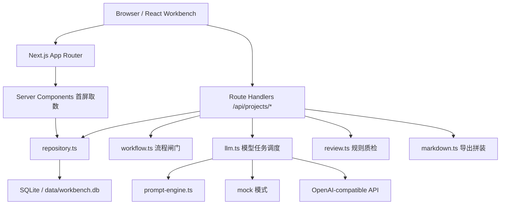
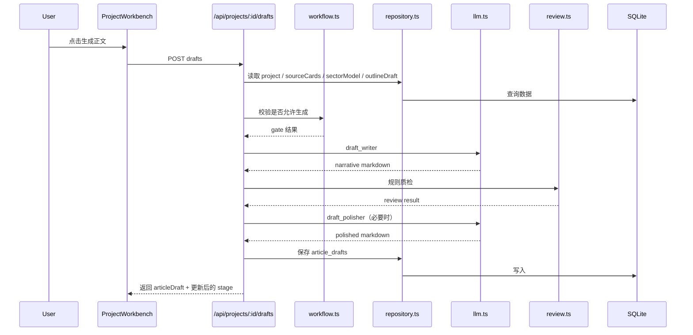

# 上海板块写作工作台系统架构与运行原理

这份文档用于完整说明当前项目的运行框架、模块关系、数据流、阶段状态、模型调用方式和系统边界。

目标不是只解释“用了什么技术”，而是解释：

- 这个系统本质上是什么
- 它为什么这样拆
- 页面、接口、数据库、模型、规则层分别承担什么职责
- 一次完整写作任务是怎样被推进的
- 当前实现到了哪里，边界又在哪里

---

## 1. 系统定位

这个项目当前不是传统意义上的“网站 + 独立后端服务 + 云数据库”架构。

它是一个：

- 单仓库
- 本地优先
- 单人使用
- 流程驱动
- 状态持久化
- 模型与规则混合编排

的写作工作台。

一句话概括：

> 这不是一个一次性出稿器，而是一个把上海板块分析写作流程拆成多个可追溯阶段的本地写作操作系统。

---

## 2. 当前技术栈

运行层：

- Next.js 16 App Router
- React 19
- TypeScript

持久化：

- Node `node:sqlite`
- 本地 SQLite 文件：`data/workbench.db`

模型层：

- OpenAI-compatible API
- `mock` 模式本地兜底

辅助能力：

- Playwright
- AppleScript
- Python 脚本导入样本

关键入口文件：

- 页面入口：[app/page.tsx](/Users/gtjunshi/Desktop/ddd/app/page.tsx:1)
- 主工作台：[components/project-workbench.tsx](/Users/gtjunshi/Desktop/ddd/components/project-workbench.tsx:33)
- 数据库初始化：[lib/db.ts](/Users/gtjunshi/Desktop/ddd/lib/db.ts:1)
- 仓储层：[lib/repository.ts](/Users/gtjunshi/Desktop/ddd/lib/repository.ts:1)
- 流程闸门：[lib/workflow.ts](/Users/gtjunshi/Desktop/ddd/lib/workflow.ts:1)
- 模型任务入口：[lib/llm.ts](/Users/gtjunshi/Desktop/ddd/lib/llm.ts:1)
- Prompt 编排：[lib/prompt-engine.ts](/Users/gtjunshi/Desktop/ddd/lib/prompt-engine.ts:1)
- 规则质检：[lib/review.ts](/Users/gtjunshi/Desktop/ddd/lib/review.ts:1)
- Markdown 导出：[lib/markdown.ts](/Users/gtjunshi/Desktop/ddd/lib/markdown.ts:1)

### 2.1 当前 job system 覆盖范围

当前长任务已经分成两类：

- 已接入 SQLite job system + 独立 worker 的步骤
  - `research-brief`
  - `sector-model`
  - `outline`
  - `drafts`
  - `review`
  - `publish-prep`
  - `source-card extract`
  - `source-card summarize`
- 仍保持同步执行的轻操作
  - 资料卡最终保存
  - 资料卡删除
  - 人工改写稿保存
  - ThinkCard / StyleCore / 研究清单 / 板块建模 / 提纲的手工保存

这意味着当前系统已经把主要的模型调用和抓取型长任务统一收口到同一套 job / worker / polling / retry 机制中，而没有再引入第二套异步基础设施。

---

## 3. 架构总览

### 3.1 分层结构

系统可以理解成 4 层：

1. 表现层
2. 接口编排层
3. 领域服务层
4. 持久化层

### 3.2 设计核心

当前系统的核心设计不是 MVC，而是：

- 用页面承载工作台交互
- 用 API route 表达阶段动作
- 用 SQLite 保存全过程状态
- 用 LLM 负责阶段生成
- 用规则层负责硬约束和兜底
- 用 `stage` 把整个项目组织成一个可推进的状态机

所以它更接近：

> 工作流系统 + 任务编排器 + 本地知识库 + 写作生成器

---

## 4. 目录与职责地图

### 4.1 页面与组件

- `app/page.tsx`
  - 首屏服务端取数
  - 读取项目列表、样本列表、默认项目 bundle
- `components/project-workbench.tsx`
  - 前端主控制器
  - 负责 tab 切换、项目切换、步骤触发、反馈提示
- `components/workbench/*`
  - 分区域展示 Overview、Research、Drafts、Review 等面板

### 4.2 API 层

- `app/api/projects/route.ts`
  - 项目列表与项目创建
- `app/api/projects/[id]/route.ts`
  - 项目 bundle 读取
  - ThinkCard / StyleCore / 兼容字段保存
- `app/api/projects/[id]/research-brief/route.ts`
  - 研究清单生成
- `app/api/projects/[id]/source-cards/*`
  - 资料卡读取、创建、抓取、摘要
- `app/api/projects/[id]/sector-model/route.ts`
  - 板块建模生成
- `app/api/projects/[id]/outline/route.ts`
  - 提纲生成
- `app/api/projects/[id]/drafts/route.ts`
  - 正文生成与人工保存
- `app/api/projects/[id]/review/route.ts`
  - 质检与 VitalityCheck
- `app/api/projects/[id]/publish-prep/route.ts`
  - 发布前整理稿生成
- `app/api/projects/[id]/export/markdown/route.ts`
  - 最终 Markdown 导出
- `app/api/topic-cocreate/route.ts`
  - 选题共创入口

### 4.3 领域服务层

- `lib/repository.ts`
  - 数据读写统一入口
  - 数据表与领域对象映射
  - 聚合 `ProjectBundle`
- `lib/workflow.ts`
  - 阶段闸门与输入校验
- `lib/llm.ts`
  - 任务化模型调用
  - 超时、token、JSON 解析、mock 兜底
- `lib/prompt-engine.ts`
  - 不同阶段任务的 Prompt 模板
- `lib/review.ts`
  - 规则层质检
- `lib/markdown.ts`
  - 导出产物拼装
- `lib/url-extractor.ts`
  - 外链正文抓取
- `lib/browser-extractor.ts`
  - 微信等保护页面浏览器回退抓取

---

## 5. 首屏运行原理

### 5.1 首次打开页面时发生什么

首页不是一个纯前端空页面，而是服务端先把首屏数据准备好。

[app/page.tsx](/Users/gtjunshi/Desktop/ddd/app/page.tsx:4) 的逻辑非常直接：

1. `listProjects()` 读取项目列表
2. `listSampleArticles()` 读取样本库
3. 如果存在项目，取第一个项目的 `ProjectBundle`
4. 把这些数据作为初始 props 传给 `ProjectWorkbench`

这意味着：

- 首屏有真实数据
- 不需要前端先空转再二次请求全部核心数据
- 当前系统更像“服务端渲染一个本地控制台”

### 5.2 前端工作台如何驱动后续流程

[components/project-workbench.tsx](/Users/gtjunshi/Desktop/ddd/components/project-workbench.tsx:33) 承担了前端总控职责：

- 管项目列表
- 管当前选中项目
- 管当前 bundle
- 管 active tab
- 管 focused section
- 管 isPending
- 管反馈消息

核心动作有 3 类：

1. `refreshProjectsAndBundle`
   - 重新取项目列表和当前 bundle
2. `runProjectStep`
   - 触发某一步的 POST 接口
3. `saveProjectFrame`
   - 保存 ThinkCard / StyleCore / 兼容字段

前端本身不做复杂业务推导。
真正的流程约束和生成逻辑都放在服务端 route + `lib/` 中。

---

## 6. 项目状态机

### 6.1 阶段定义

系统把一篇文章拆成 10 个阶段，类型定义在 [lib/types.ts](/Users/gtjunshi/Desktop/ddd/lib/types.ts:8)：

1. 选题定义
2. ThinkCard / HKR
3. StyleCore
4. 研究清单
5. 资料卡整理
6. 板块建模
7. 提纲生成
8. 正文生成
9. VitalityCheck
10. 发布前整理

### 6.2 为什么要阶段化

阶段化的意义不是为了“看起来流程很完整”，而是为了保证：

- 每一步输入可见
- 每一步结果可保存
- 每一步都能人为校正
- 每一步都能设前置闸门
- 失败不会把整个写作任务打回零

### 6.3 阶段推进示意

---

## 7. 数据库与持久化设计

### 7.1 数据库初始化

[lib/db.ts](/Users/gtjunshi/Desktop/ddd/lib/db.ts:11) 在首次连接时做几件事：

- 创建 `data/` 目录
- 打开 `data/workbench.db`
- 打开 `WAL` 模式
- 启用外键
- 自动建表
- 用 `ensureColumn` 做轻量增量迁移

这说明当前系统的数据库迁移策略是：

> 运行时自初始化 + 轻量 schema 补齐

它适合本地单人工具，但还不是严格意义上的生产级迁移体系。

### 7.2 核心表

`sample_articles`

- 样本文档库
- 用于风格学习和样本参考

`article_projects`

- 主表
- 保存项目基础信息和三张主卡
- 同时保留兼容层字段 `hkrr_json`、`hamd_json`、`writing_moves_json`

`research_briefs`

- 研究清单

`source_cards`

- 资料卡库

`sector_models`

- 板块建模结果

`outline_drafts`

- 提纲结果

`article_drafts`

- 分析稿、叙事稿、人工编辑稿

`review_reports`

- 质检结果

`publish_packages`

- 标题、摘要、配图位、发布清单等发布前产物

### 7.3 为什么主项目表里保留兼容层字段

当前系统并不是完全抛弃旧的 `HKRR / HAMD / writingMoves`。

它采用的是：

- 新主表达：`ThinkCard`、`StyleCore`、`VitalityCheck`
- 旧兼容表达：`HKRR`、`HAMD`、`writingMoves`

在 [lib/repository.ts](/Users/gtjunshi/Desktop/ddd/lib/repository.ts:166) 中，更新项目时如果改了 `ThinkCard` 或 `StyleCore`，会通过 `deriveLegacyFrames` 自动派生回旧字段。

这意味着当前设计目标是：

- 前台体验升级
- 老提示词和旧规则还能继续工作
- 兼容层逐步退场而不是一次性切断

### 7.4 聚合对象 `ProjectBundle`

系统对外并不是每次分散返回多张表，而是通过 `getProjectBundle()` 聚合：

- project
- researchBrief
- sourceCards
- sectorModel
- outlineDraft
- articleDraft
- reviewReport
- publishPackage

这使得 UI 和导出层都可以用同一份完整上下文工作。

---

## 8. 仓储层原理

`repository.ts` 的职责不是单纯 CRUD，而是“领域对象装配”。

### 8.1 主要职责

- 把 SQLite 行映射成类型化对象
- 在读取主项目时顺手恢复默认值
- 兼容新旧字段
- 聚合出完整 `ProjectBundle`

### 8.2 为什么它重要

如果没有这一层：

- 路由层会直接写 SQL
- 默认值和容错逻辑会散掉
- 新旧字段兼容会分裂在多个文件
- 页面层会拿到很多原始 JSON 字符串

所以它本质上是当前项目的“本地领域仓储层”。

---

## 9. API 编排原理

### 9.1 API 不是资源式 CRUD，而是阶段动作

这个项目虽然也有 CRUD，但核心不是 REST 资源管理，而是“流程动作表达”。

例如：

- `POST /api/projects/:id/research-brief`
- `POST /api/projects/:id/sector-model`
- `POST /api/projects/:id/outline`
- `POST /api/projects/:id/drafts`
- `POST /api/projects/:id/review`
- `POST /api/projects/:id/publish-prep`

这些接口的真实含义是：

> 对当前项目执行一个阶段任务

### 9.2 项目创建

[app/api/projects/route.ts](/Users/gtjunshi/Desktop/ddd/app/api/projects/route.ts:13) 创建项目时有两种路径：

1. 输入已经带完整卡片
2. 输入只是选题，系统先跑 `think_card` 任务

然后再：

- 把新卡转成兼容层字段
- 创建 `ArticleProject`
- 默认进入 `ThinkCard / HKR`

### 9.3 项目 PATCH

[app/api/projects/[id]/route.ts](/Users/gtjunshi/Desktop/ddd/app/api/projects/[id]/route.ts:22) 的 PATCH 承担“人工修卡”职责：

- 合并 ThinkCard
- 合并 StyleCore
- 合并兼容层字段
- 允许顺手保存 `researchBrief` / `sectorModel` / `outlineDraft`
- 根据卡片是否完整自动修正阶段

这说明：

- 人工编辑是一级能力
- 不是只允许模型生成
- route 会维护状态一致性

---

## 10. 工作流闸门原理

[lib/workflow.ts](/Users/gtjunshi/Desktop/ddd/lib/workflow.ts:4) 是整个系统里非常关键的一个文件。

它负责的不是生成，而是“是否允许进入下一步”。

### 10.1 主要闸门

`canGenerateResearch`

- 看 ThinkCard 是否过线

`canGenerateOutline`

- 先看 ThinkCard
- 再看 StyleCore 是否满足提纲生成需要

`canGenerateDraft`

- 先复用 `canGenerateOutline`
- 再看 StyleCore 是否满足正文生成需要

`canPreparePublish`

- Review 与 VitalityCheck 不过线时，不让进发布前整理

### 10.2 强行继续机制

某些 gate 允许 `warn` 状态下继续，但必须显式确认。

接口层会返回：

- `409`
- `needsConfirmation: true`

前端看到后会弹 `window.confirm`，确认后带 `forceProceed` 再打一次接口。

这个机制说明系统不是死板地“全过才能继续”，而是允许：

- 默认保守
- 人工承担风险
- 明确留痕

---

## 11. 模型任务系统

### 11.1 为什么不是一个总 Prompt

[lib/llm.ts](/Users/gtjunshi/Desktop/ddd/lib/llm.ts:24) 和 [lib/prompt-engine.ts](/Users/gtjunshi/Desktop/ddd/lib/prompt-engine.ts:18) 共同定义了“任务化模型调用”。

当前任务类型包括：

- `topic_cocreate`
- `think_card`
- `topic_judge`
- `source_card_summarizer`
- `research_brief`
- `sector_modeler`
- `outline_writer`
- `draft_writer`
- `draft_polisher`
- `vitality_reviewer`
- `quality_reviewer`
- `publish_prep`
- `publish_summary_refiner`

这意味着系统不是“把所有上下文塞给模型写一篇文章”，而是把不同认知任务拆开：

- 判断题值
- 整理资料
- 做研究框架
- 做板块模型
- 做结构
- 写正文
- 修正文
- 做编辑质检
- 整理发布稿

### 11.2 模型运行模式

`llm.ts` 支持两种模式：

`mock`

- 不调远程模型
- 返回本地模拟结果
- 方便本地走流程

`remote`

- 走 OpenAI-compatible API
- 由环境变量控制

关键环境变量：

- `MODEL_MODE`
- `MODEL_NAME`
- `MODEL_API_BASE_URL`
- `MODEL_API_PATH`
- `MODEL_API_KEY`
- `MODEL_TEMPERATURE`

### 11.3 为什么每种任务有不同超时和 token

不同任务产物长度差异很大：

- 选题卡和板块建模要结构化 JSON
- 正文生成要 Markdown
- 发布摘要只需要短文本

所以 `getTaskTuning()` 为不同任务配置：

- timeout
- max tokens
- retry max tokens
- 是否使用 JSON mode

这样做的好处是：

- 更容易定位哪一步慢
- 更容易针对单任务调优
- 失败边界更清楚

### 11.4 异常处理策略

`runStructuredTask()` 里对失败做了几层处理：

- timeout 错误转成可读中文提示
- JSON 解析失败区分为“截断”还是“格式不完整”
- 某些任务允许提高 token 再试一次
- `draft_writer` / `draft_polisher` 直接按 Markdown 处理

这说明当前模型层不是裸调用，而是已经有：

- 调参层
- 解析层
- 重试层
- 兜底层

---

## 12. Prompt 设计原理

Prompt 不是散落在接口里，而是集中在 `prompt-engine.ts`。

### 12.1 统一输入上下文

每个任务可以拿到一组上下文字段，例如：

- `project`
- `sourceCards`
- `researchBrief`
- `sectorModel`
- `outlineDraft`
- `styleReference`
- `deterministicReview`

### 12.2 Prompt 的核心约束

Prompt 系统里明确写了很多“不是为了生成更长内容，而是为了生成更像项目方法论的内容”的规则：

- 学样本，但不能抄样本表达
- 学判断路径，不学旧标题抓手
- 先定义 ThinkCard，再定义 StyleCore
- 强制输出 JSON
- 对不同文章类型注入不同约束
- 对语言资产做禁区和可用表达控制

所以 Prompt 层不是普通内容提示词，而是：

> 项目方法论的程序化表达层

---

## 13. 选题共创原理

[app/api/topic-cocreate/route.ts](/Users/gtjunshi/Desktop/ddd/app/api/topic-cocreate/route.ts:1) 是正式项目创建前的前置环节。

它做的不是直接创建文章，而是：

1. 输入板块、直觉、材料
2. 对材料做整理
3. 输出多个候选角度
4. 再从候选角度进入正式项目

这个设计的意义是：

- 把“选题生成”和“文章生成”拆开
- 先解决方向对不对
- 再进入正式写作流程

---

## 14. 资料卡系统原理

### 14.1 资料卡为什么是核心

当前系统明确要求：

> 关键判断必须挂资料来源

所以资料卡不是附件，而是正文的证据基础设施。

### 14.2 资料卡创建方式

[app/api/projects/[id]/source-cards/route.ts](/Users/gtjunshi/Desktop/ddd/app/api/projects/[id]/source-cards/route.ts:17) 支持：

- 手动填写
- 粘贴原文后自动摘要

自动摘要会提取：

- 标题
- summary
- evidence
- tags

然后保存成 `SourceCard`。

### 14.3 外链抓取原理

[app/api/projects/[id]/source-cards/extract/route.ts](/Users/gtjunshi/Desktop/ddd/app/api/projects/[id]/source-cards/extract/route.ts:9) 调用 [lib/url-extractor.ts](/Users/gtjunshi/Desktop/ddd/lib/url-extractor.ts:17)：

默认策略：

- 普通 HTTP 抓取 HTML
- 通用页面抽 `<article>` / `<main>` / `<body>`
- 微信页面优先走公众号正文提取逻辑

如果微信页面遇到保护页：

- 回退到 [lib/browser-extractor.ts](/Users/gtjunshi/Desktop/ddd/lib/browser-extractor.ts:8)
- 先尝试 Playwright 持久化浏览器
- 再失败则回退到 Chrome + AppleScript 抓当前 tab 正文

这说明当前项目的抓取能力是：

- 优先简单模式
- 特殊站点走专门处理
- 再不行走桌面浏览器自动化

### 14.4 当前抓取边界

虽然支持抓链接，但它仍然不是“全网爬虫系统”：

- 没有通用账号体系
- 没有反爬调度
- 没有批量队列
- 更偏单条人工辅助抓取

---

## 15. 板块建模原理

板块建模不是生成一段泛分析，而是把资料组织成结构化的空间判断。

模型输出的核心包括：

- 总判断
- 误解点
- 空间骨架
- 切割线
- 片区拆解
- 供应观察
- 未来 watchpoints
- 证据绑定

所以这一步的意义是：

- 把资料卡从零散证据变成空间模型
- 为提纲生成提供结构骨架

如果没有资料卡，这一步直接禁止执行。

---

## 16. 提纲生成原理

提纲不是普通目录，而是动作化提纲。

每个 section 除了 heading 之外，还有：

- `purpose`
- `evidenceIds`
- `tone`
- `move`
- `break`
- `bridge`
- `styleObjective`
- `keyPoints`
- `expectedTakeaway`

所以它不是“先写 A 再写 B”，而是“这段为什么存在、怎么推进、怎么打破、靠什么证据支撑”。

这是当前系统跟普通提纲器非常不同的地方。

---

## 17. 正文生成原理

[app/api/projects/[id]/drafts/route.ts](/Users/gtjunshi/Desktop/ddd/app/api/projects/[id]/drafts/route.ts:13) 是整套系统里最复杂的单步之一。

### 17.1 前置条件

正文生成前必须满足：

- 项目存在
- gate 允许
- 有资料卡
- 有板块建模
- 有提纲

### 17.2 生成流程

1. 调 `draft_writer` 生成 narrative markdown
2. 修复引用 ID
3. 根据提纲 bridge 注入更自然的段落承接
4. 用 thesis / anchor 做结尾回环兜底
5. 跑一次规则质检
6. 如果 opening / hook / anchor / echo / citations 等关键项不过关
7. 再调用 `draft_polisher`
8. 最后保存：
   - `analysisMarkdown`
   - `narrativeMarkdown`
   - `editedMarkdown`

### 17.3 为什么保存双稿

系统现在同时保存：

- 分析版
- 叙事版
- 人工编辑版

这样做的意义是：

- 分析版用于回看结构和证据骨架
- 叙事版用于模型原始生成
- 人工编辑版用于最终修稿

这对后续人工协作和导出都很重要。

---

## 18. 规则质检与 VitalityCheck

### 18.1 为什么不是只靠模型审稿

[lib/review.ts](/Users/gtjunshi/Desktop/ddd/lib/review.ts:23) 里有一套明确的规则质检。

它检查的不是抽象的“好不好”，而是项目方法论要求的关键项，比如：

- HAMD 是否完整
- HKRR 是否完整
- 写作动作卡是否完整
- 片区数是否在 3-5
- 有没有空间骨架
- 关键判断有没有挂 `[SC:...]`
- 是否有 AI 套话
- 是否过软文
- 开头是否有反常识信号
- hook / anchor / different 是否落地
- 有没有人物场景
- 有没有文化升维
- 有没有现实代价
- 结尾有没有回环

### 18.2 质检是双轨制

[app/api/projects/[id]/review/route.ts](/Users/gtjunshi/Desktop/ddd/app/api/projects/[id]/review/route.ts:27) 的处理方式是：

1. 先跑规则质检 `runDeterministicReview`
2. 再尝试跑 `vitality_reviewer`
3. 如果模型质检成功，则合并
4. 如果模型超时，则保留规则层结果

这套设计很关键，因为它保证：

- 没有远程模型时也能质检
- 模型不稳定时流程不至于断
- 规则层永远是基础保障

### 18.3 VitalityCheck 的意义

`VitalityCheck` 不是简单“有没有 bug”，而是判断：

- 这篇是不是还有生命力
- 是不是只剩结构没有气口
- 能不能进入发布前整理

换句话说，它是这套写作系统里的“最终表达闸门”。

---

## 19. 发布前整理原理

[app/api/projects/[id]/publish-prep/route.ts](/Users/gtjunshi/Desktop/ddd/app/api/projects/[id]/publish-prep/route.ts:16) 做的是把文章从“写完”推进到“可发布”。

生成内容包括：

- 标题候选
- 摘要
- 配图位建议
- 发布检查清单

如果摘要太像元叙事，会再跑一次 `publish_summary_refiner`。

这说明发布前整理不是简单拼装，而是一个单独的整理步骤。

---

## 20. 导出原理

[lib/markdown.ts](/Users/gtjunshi/Desktop/ddd/lib/markdown.ts:3) 的导出逻辑不是只吐正文，而是把整个项目打包成完整 Markdown：

- 项目头信息
- ThinkCard
- StyleCore
- 核心问题
- 研究清单
- 板块建模
- 提纲
- 成文稿
- 资料卡索引
- 质检报告
- VitalityCheck
- 发布前整理

导出接口在 [app/api/projects/[id]/export/markdown/route.ts](/Users/gtjunshi/Desktop/ddd/app/api/projects/[id]/export/markdown/route.ts:9)。

这意味着当前导出产物不是单纯成品文章，而是：

> 一份包含判断、证据、结构、正文、质检和发布素材的完整项目档案

---

## 21. 一次完整请求的数据流

以“生成正文”为例：

---

## 22. 配置与运行模式

### 22.1 本地运行脚本

`package.json` 中的核心脚本：

- `npm run dev`
- `npm run build`
- `npm run start`
- `npm run lint`
- `npm run typecheck`
- `npm run import-samples`
- `npm run backfill-project-frames`

### 22.2 样本导入

项目支持把 `wz/` 目录中的 `.docx` 样本导入 SQLite。

这部分是样本库的来源，不是线上抓取逻辑。

### 22.3 模型模式

`MODEL_MODE=mock`

- 用于本地走流程

配置 API Key 时：

- 走远程模型
- 任务化调用生效

---

## 23. 当前明确边界

根据 README 和代码实现，当前系统有这些明确边界：

- 单人使用，不含登录和权限系统
- 本地优先，不依赖云数据库
- 导出 Markdown，不直接生成 DOCX/公众号排版稿
- 抓取能力偏单条辅助，不是批量爬虫
- 没有真正的队列系统和后台任务系统
- 没有多人协作冲突处理
- 没有严格数据库迁移体系
- 没有外部对象存储
- 没有搜索索引服务

---

## 24. 当前架构的优点

### 24.1 优点

- 单体结构简单，理解成本低
- 本地 SQLite 易于部署
- 每一步都落库，状态可回溯
- 模型层按任务拆分，便于调优
- 规则质检能兜底，不完全依赖模型
- 新卡系统与旧兼容层共存，迁移风险低
- 导出是完整项目档案，不丢过程信息

### 24.2 特别适合的场景

- 个人写作工作台
- 方法论尚在快速迭代期
- 需要频繁改 Prompt 和规则
- 更重视写作过程质量，而不是海量并发

---

## 25. 当前架构的限制与风险

### 25.1 架构限制

- 路由层承担了不少编排责任，后续继续加复杂度会变重
- SQLite 适合单机单人，不适合多人并发写入
- 迁移机制偏轻，不适合高频复杂 schema 演进
- Prompt 与任务耦合较深，后期若任务数继续增长，维护成本会上升
- 目前没有任务队列，长任务全在请求生命周期中完成

### 25.2 工程风险

- 正文、质检这类长耗时任务会受 HTTP 超时影响
- 链接抓取容易受站点保护策略影响
- 回退到 AppleScript / Chrome 的逻辑有环境依赖
- mock 模式和 remote 模式的结果可能差异较大

---

## 26. 后续可演进方向

如果后续要继续往前走，可能的演进方向有：

### 26.1 任务系统化

- 把长任务从 route 内同步执行改成后台任务
- 给每一步生成任务状态和日志

### 26.2 存储升级

- 从 SQLite 过渡到更完整的数据库方案
- 引入正式 migration

### 26.3 编排层抽离

- 把 route handler 中的流程拼装进一步下沉到 service/use-case 层

### 26.4 资料系统增强

- 更强的来源管理
- 更细的引用覆盖率分析
- 评论类、访谈类、官方口径类来源分层

### 26.5 协作能力

- 多人项目
- 审阅状态
- 版本比较

---

## 27. 给讨论者的快速结论

如果你需要向别人快速解释这个系统，可以直接这么说：

> 这是一个基于 Next.js + SQLite 的本地写作工作台。它把板块分析写作拆成选题、研究、资料卡、板块建模、提纲、正文、质检、发布前整理等多个阶段；每一步都落库；模型只负责阶段生成，规则层负责闸门和质检；最终导出的是完整项目档案，而不是一段孤立正文。

再短一点：

> 它本质上是一个写作流程状态机，不是普通 AI 写稿页。

---

## 28. 关键文件索引

页面与工作台：

- [app/page.tsx](/Users/gtjunshi/Desktop/ddd/app/page.tsx:1)
- [components/project-workbench.tsx](/Users/gtjunshi/Desktop/ddd/components/project-workbench.tsx:33)

接口：

- [app/api/projects/route.ts](/Users/gtjunshi/Desktop/ddd/app/api/projects/route.ts:1)
- [app/api/projects/[id]/route.ts](/Users/gtjunshi/Desktop/ddd/app/api/projects/[id]/route.ts:1)
- [app/api/projects/[id]/research-brief/route.ts](/Users/gtjunshi/Desktop/ddd/app/api/projects/[id]/research-brief/route.ts:1)
- [app/api/projects/[id]/source-cards/route.ts](/Users/gtjunshi/Desktop/ddd/app/api/projects/[id]/source-cards/route.ts:1)
- [app/api/projects/[id]/source-cards/extract/route.ts](/Users/gtjunshi/Desktop/ddd/app/api/projects/[id]/source-cards/extract/route.ts:1)
- [app/api/projects/[id]/sector-model/route.ts](/Users/gtjunshi/Desktop/ddd/app/api/projects/[id]/sector-model/route.ts:1)
- [app/api/projects/[id]/outline/route.ts](/Users/gtjunshi/Desktop/ddd/app/api/projects/[id]/outline/route.ts:1)
- [app/api/projects/[id]/drafts/route.ts](/Users/gtjunshi/Desktop/ddd/app/api/projects/[id]/drafts/route.ts:1)
- [app/api/projects/[id]/review/route.ts](/Users/gtjunshi/Desktop/ddd/app/api/projects/[id]/review/route.ts:1)
- [app/api/projects/[id]/publish-prep/route.ts](/Users/gtjunshi/Desktop/ddd/app/api/projects/[id]/publish-prep/route.ts:1)
- [app/api/projects/[id]/export/markdown/route.ts](/Users/gtjunshi/Desktop/ddd/app/api/projects/[id]/export/markdown/route.ts:1)
- [app/api/topic-cocreate/route.ts](/Users/gtjunshi/Desktop/ddd/app/api/topic-cocreate/route.ts:1)

核心领域层：

- [lib/db.ts](/Users/gtjunshi/Desktop/ddd/lib/db.ts:1)
- [lib/repository.ts](/Users/gtjunshi/Desktop/ddd/lib/repository.ts:1)
- [lib/workflow.ts](/Users/gtjunshi/Desktop/ddd/lib/workflow.ts:1)
- [lib/llm.ts](/Users/gtjunshi/Desktop/ddd/lib/llm.ts:1)
- [lib/prompt-engine.ts](/Users/gtjunshi/Desktop/ddd/lib/prompt-engine.ts:1)
- [lib/review.ts](/Users/gtjunshi/Desktop/ddd/lib/review.ts:1)
- [lib/markdown.ts](/Users/gtjunshi/Desktop/ddd/lib/markdown.ts:1)
- [lib/url-extractor.ts](/Users/gtjunshi/Desktop/ddd/lib/url-extractor.ts:1)
- [lib/browser-extractor.ts](/Users/gtjunshi/Desktop/ddd/lib/browser-extractor.ts:1)

相关方法论文档：

- [docs/shanghai-writing-action-system.md](/Users/gtjunshi/Desktop/ddd/docs/shanghai-writing-action-system.md)
- [docs/shanghai-writing-operating-system.md](/Users/gtjunshi/Desktop/ddd/docs/shanghai-writing-operating-system.md)
- [docs/digital-writer-spec.md](/Users/gtjunshi/Desktop/ddd/docs/digital-writer-spec.md)
